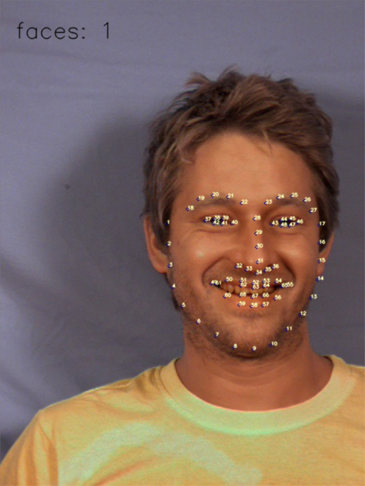

Face detection with 68 features points
######################################

Introduction
************

Detect faces from camera, and draw the 
68 feature points of faces;

调用摄像头进行人脸检测，并进行68个特征
点标定;

68个特征点位置:
   

* Please install python packages: dlib and numpy at first:

.. code-block:: bash

   pip3 install -r requirements.txt

About Source Code
*****************

Python 源码介绍如下:

#. Use camera in Python / Python OpenCv 调用摄像头;

   .. code-block:: python

      python3 how_to_use_camera.py:

#. Show the 68 features points from local images / 显示本地图像文件中的人脸特征;

   .. code-block:: python

      python3 get_features_from_images.py:

#. Real-time facial landmarks detect and draw feature points /这一步将调用摄像头进行实时人脸检测和特征点绘制;

   .. code-block:: python

      python3 get_features_from_camera.py:

More
****

Author: coneypo

Blog: https://www.cnblogs.com/AdaminXie/p/8472743.html

Mail: coneypo@foxmail.com

Thanks for your support.